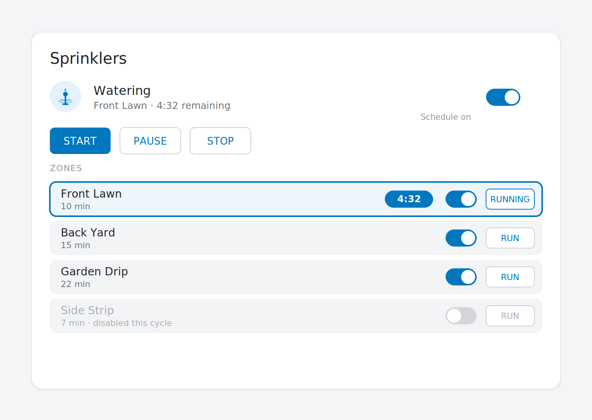

# ESPrinkler Lovelace Card

The Home Assistant dashboard card for ESPrinkler — a **separate artifact** from the firmware,
on its **own release track**, distributed via **HACS**.



*Representative render with one zone running. Real card colors track your HA theme.*

It's a [Lit](https://lit.dev) custom element that runs in the browser and talks to HA core
(not the device). It binds to the [entity contract](../docs/entity-contract.md): give it the
controller's state entities and a list of zones, and it renders status, start/stop/pause,
the schedule toggle, and per-zone enable/run with live countdowns.

## Install via HACS (recommended)

1. In Home Assistant, open **HACS → ⋮ menu → Custom repositories**.
2. Add `https://github.com/TheSmartWorkshop/ESPrinkler` with type **Dashboard**.
   (HACS renamed the old "Lovelace / Plugin" type to **Dashboard** — same thing.)
3. Click **ESPrinkler Card** in the list, then **Download**.
4. HACS registers it as a Lovelace resource automatically. Reload the browser.
5. Edit a dashboard → **Add card** → search **ESPrinkler Card** and pick it.
   The visual editor opens with empty fields ready to fill — no YAML required.

Updates land here the same way: HACS will show a new version when a `card-v*` tag is
published in this repo.

## Install manually (without HACS)

1. Grab `esprinkler-card.js` from the latest [release](../../../releases?q=card-v).
2. Drop it in `config/www/` of your Home Assistant config.
3. Add `/local/esprinkler-card.js` as a **JavaScript Module** resource
   (Settings → Dashboards → Resources).
4. Add the card to a dashboard.

## Card configuration

### Visual editor (recommended)

Add the card from your dashboard's **Add card → ESPrinkler Card** and you'll get a
full GUI editor: expandable sections for **Controller state**, **Controls**,
**Adjustments**, and **Zone-map overlay**, plus a **Zones** list with per-zone
add / remove / reorder. Every entity field is an HA entity picker filtered to the
correct domain (switch, sensor, button, etc.), and the zone-map pin positions use
slider inputs that round-trip cleanly back to YAML.

The editor and the YAML below are interchangeable: anything you set in the GUI
serializes back to the same config keys, so you can flip to **Show code editor**
at any time.

### YAML reference

Zone entity ids follow `switch.<device>_zone_<N>` if you copied
[`examples/oled.yaml`](../examples/oled.yaml) — the firmware now uses generic `Zone N`
names so the labels can be edited at runtime via `text.<device>_zone_<N>_name` (the
template-text entities in that example) or HA's own rename UI.

```yaml
type: custom:esprinkler-card
title: Sprinklers

# Controller-level (from the esprinkler: brain)
state_entity: sensor.esprinkler_state                # text_sensor -> sensor in HA
active_zone_entity: sensor.esprinkler_active_zone
active_remaining_entity: sensor.esprinkler_total_time_remaining
next_run_entity: sensor.esprinkler_next_run
schedule_switch: switch.esprinkler_schedule_enabled  # master arm/disarm
rain_delay_entity: number.esprinkler_rain_delay      # hours; write to delay

# Controls (from the sprinkler: engine)
start_button: switch.esprinkler_sprinklers           # main switch acts as start
stop_button: switch.esprinkler_sprinklers

zones:
  - name_entity: text.esprinkler_zone_1_name         # live label; updates when you rename
    valve: switch.esprinkler_zone_1
    enable: switch.esprinkler_zone_1_enabled
    duration: number.esprinkler_zone_1_duration
    active: binary_sensor.esprinkler_zone_1_active
    remaining: sensor.esprinkler_zone_1_remaining
  - name_entity: text.esprinkler_zone_2_name
    valve: switch.esprinkler_zone_2
    enable: switch.esprinkler_zone_2_enabled
    duration: number.esprinkler_zone_2_duration
    active: binary_sensor.esprinkler_zone_2_active
    remaining: sensor.esprinkler_zone_2_remaining
  # ...repeat for each zone
```

`name_entity` is optional: if you'd rather hardcode the labels in YAML, set `name:`
instead (`name` wins over `name_entity` when both are given).

> Entity ids depend on your device's `friendly_name`. The examples above assume a device
> named `esprinkler` (i.e. `esphome: name: esprinkler`).

### Zone-map overlay

Drop in a top-down photo or sketch of the yard, then position a clickable pin per zone with
percent coordinates. Pins highlight while their zone is watering and show the live countdown;
tapping one starts the zone.

```yaml
type: custom:esprinkler-card
# ...controller bindings as above...
zone_map:
  image: /local/yard.jpg     # any URL or local-path
  aspect_ratio: "16/9"       # optional; defaults to the image's natural ratio
zones:
  - name_entity: text.esprinkler_zone_1_name
    valve: switch.esprinkler_zone_1
    active: binary_sensor.esprinkler_zone_1_active
    remaining: sensor.esprinkler_zone_1_remaining
    map_position: { x: 25, y: 30 }
  - name_entity: text.esprinkler_zone_2_name
    valve: switch.esprinkler_zone_2
    active: binary_sensor.esprinkler_zone_2_active
    remaining: sensor.esprinkler_zone_2_remaining
    map_position: { x: 70, y: 65 }
```

Positions are in percent (0-100) so the layout scales with the card width. Zones without a
`map_position` are omitted from the overlay but still appear in the list view below it.

## Build from source

```bash
cd card
npm install
npm run build      # -> dist/esprinkler-card.js
npm run lint       # tsc --noEmit
```

`dist/esprinkler-card.js` is the single Lovelace resource. It's a build artifact (gitignored);
CI builds it on PRs and the `release-card.yml` workflow attaches it to a GitHub release on
each `card-v*` tag.

## Roadmap

- **v0.3:** live zone renames via `name_entity`, HACS distribution.
- **v0.4 (now):** visual config editor covering every field (controller, controls,
  adjustments, zone-map, zones with add/remove/reorder), HA entity pickers filtered
  per domain, slider inputs for map pin coordinates.
- **Next:** drag-to-position the zone-map pins on the actual image; presets for
  common ESPrinkler entity-naming conventions to auto-populate the editor.

Precedent worth studying: [`EvotecIT/lovelace-lawn-mower-card`](https://github.com/EvotecIT/lovelace-lawn-mower-card).
