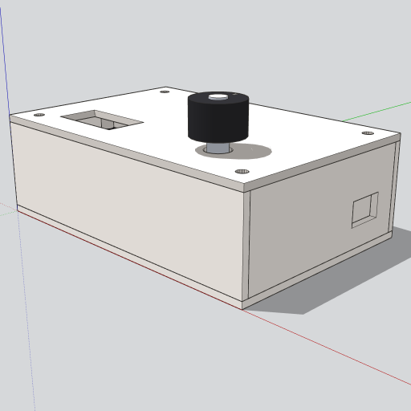
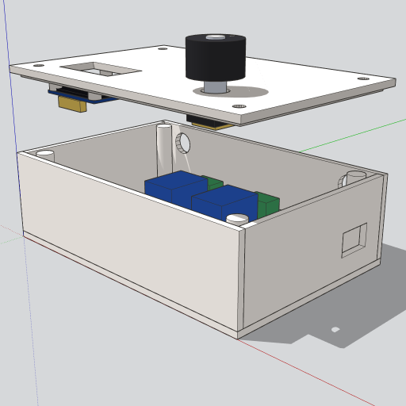

# 2-Zone Enclosure (top-mount controls)

A 3D-printable enclosure for a minimum-viable ESPrinkler build: **ESP32-C3**,
**OLED 128x64**, **rotary encoder + push button**, **2-channel relay**.
Designed for wall mounting with the controls on top so the user looks down
at the OLED and reaches the knob from above.





## Files

- [`skp/enclosure-2zone-closed.skp`](skp/enclosure-2zone-closed.skp) — assembled view
- [`skp/enclosure-2zone-exploded.skp`](skp/enclosure-2zone-exploded.skp) — lid raised, components visible

Open in SketchUp (desktop or Web). To produce STLs for printing, select the
**Chassis** and **Lid** groups and use `File → Export → 3D Model → STL`.

## External envelope

| Dimension | Inches | mm |
| --- | --- | --- |
| Width (X) | 4.50 | 114 |
| Depth (Y) | 3.00 | 76 |
| Height (Z) | 1.45 | 37 |
| Wall / lid thickness | 0.10 | 2.5 |

The case body is **1.45"** tall; the rotary knob adds ~0.65" above the lid.

## Two printable parts

The model splits into a chassis (open-top tray) and a lid that drops in with a
small lip and four corner screws.

### Chassis

Open-top tray, walls 0.10" thick. Cutouts:

| Face | Feature | Dimensions | World location |
| --- | --- | --- | --- |
| Right | USB-C access | 0.55w x 0.35h | Y 2.025-2.575, Z 0.40-0.75 |
| Back | Wire entry slot | 1.50w x 0.20h | X 1.50-3.00, Z 0.20-0.40 |
| Back | Wall-mount hole (left) | dia 0.36 | (X 0.55, Z 1.05) |
| Back | Wall-mount hole (right) | dia 0.36 | (X 3.95, Z 1.05) |
| Front | — (smooth) | — | — |
| Left | — (smooth) | — | — |

Mount the back face to a wall with two screws through the 0.36" holes (clears
a #8 pan head). Wires drop in through the cable slot under the screws.

Internal mounting bosses (all 0.18 OD cylindrical posts unless noted):

- **4 lid screw posts** at corners (0.30, 0.30), (4.20, 0.30), (4.20, 2.70),
  (0.30, 2.70) — 0.26 OD, 1.25 tall, accept self-tapping screws from the lid.
- **4 relay-module standoffs** at PCB-hole positions for a generic 2-channel
  relay module (~50 x 39 mm PCB) — 0.18 tall.
- **2 ESP32-C3 standoffs** on the non-USB end of the XIAO board, oriented so
  the USB-C jack aligns with the right-wall cutout — 0.18 tall.

### Lid

Flat plate with cutouts and a perimeter lip frame for friction-fit alignment.

| Feature | Dimensions | World location on lid |
| --- | --- | --- |
| OLED window | 1.10w x 0.60d | X 0.60-1.70, Y 0.45-1.05 |
| Rotary shaft hole | dia 0.36 | (X 3.40, Y 0.75) |
| 4 lid screw clearance holes | dia 0.15 | corners (0.30, 0.30) etc. |
| Interior lip frame | 4.28 x 2.78 outer, 0.12 wide, 0.06 deep | centered |

The lip is a **perimeter frame** (a thin rectangular ring around the edge),
not a solid plate — so it clears the OLED window and the OLED standoffs that
hang from the lid underside.

Four **OLED standoffs** (0.18 OD x 0.20 tall) hang from the lid underside at
(0.70, 0.30), (1.60, 0.30), (1.60, 1.20), (0.70, 1.20) — the 23 mm x 23 mm
hole pattern for a standard 0.96" SSD1306 module.

The KY-040 / EC11 encoder mounts directly to the lid by its threaded bushing
(nut + washer on the outside). No internal bracket is needed for it.

## Layout (top view)

```
   +-----------------------------------+   <- back wall (cable + 2 mount holes)
   |  o                              o |
   |       [ Relay ][ Relay ]          |   <- 2-channel relay module
   |       term     term               |
   |  o                              o |
   | (lid screw)                       |
   |                       [ESP32]     |   <- XIAO ESP32-C3, USB-C facing right
   |       [OLED]    (knob)            |   <- on lid (above, top-mount)
   +-----------------------------------+   <- front wall (smooth)
       0                            4.5  (X, inches)
```

## Print notes

- **Material:** PLA or PETG. 0.20 mm layer height is fine; 0.15 mm cleans up
  the screw-hole edges.
- **Orientation:** print chassis with the open top facing up (no supports needed
  inside). Print the lid flat (face down). The lid cutouts print bridge-free.
- **Infill:** 20-25 % is plenty for either part.
- **Screws:** four #4 x 1/2" self-tapping screws hold the lid to the chassis.
  Two #8 wood screws (or wall plugs) anchor the chassis to a wall through the
  back-wall mount holes.

## Compatibility notes

This is a **representative** model, not a verified hardware fit-check. The
internal layout and mounting-boss positions assume:

- **ESP32-C3:** Seeed XIAO ESP32-C3 (21 x 17.8 x 3.5 mm, USB-C on the short
  edge). Larger ESP32-C3 boards (e.g. DevKitC) won't fit without resizing.
- **OLED:** generic SSD1306 0.96" 128x64 module with 27 x 27 mm PCB and
  4-pin I2C header. The 23 x 23 mm corner-hole pattern is standard.
- **Rotary encoder:** EC11-style rotary encoder with 7 mm threaded bushing
  and push-button (KY-040 module wiring; encoder mounted directly to the
  lid, wired to the ESP32 with short jumpers).
- **Relay module:** generic 2-channel 5 V relay board, ~50 x 39 mm PCB,
  screw-terminal NO/COM/NC outputs on one long edge.

Adjust the dimensions in the SketchUp file if your specific modules differ.
The geometry helpers in the source SketchUp Python script are parameterized
on width, depth, height and cutout positions — small edits regenerate cleanly.
